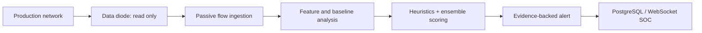

# SentinelAI OS

SentinelAI OS is a React + FastAPI cybersecurity dashboard for local demos, security analysis workflows, live threat telemetry, and AI-assisted security tooling.

## Share this project safely

Do not commit or send your real API keys, `.env` files, databases, generated reports, or virtual environments. Those files are excluded by [.gitignore](.gitignore).

Before sharing, check exactly what Git will upload:

```powershell
git status
git add .
git status
```

Only commit files you recognize. If a key was ever committed, revoke it at its provider before sharing the repository.

## Requirements

- Git
- Node.js 20 LTS (Node.js 18+ also works)
- Python 3.11 or 3.12

## Run locally on Windows

These commands start the complete local development stack. No API key, PostgreSQL instance, or Docker installation is required for the demo experience.

```powershell
git clone <your-repository-url>
cd SentinelAI-OS

python -m venv backend\.venv
.\backend\.venv\Scripts\Activate.ps1
python -m pip install --upgrade pip
pip install -r backend\requirements.txt

cd frontend
npm install
npm run dev
```

Open http://localhost:5173 when Vite reports that it is ready. `npm run dev` starts the FastAPI backend on port `8000` automatically, then starts the Vite frontend on port `5173`.

To stop both processes, press `Ctrl+C` in the terminal that is running `npm run dev`.

### PowerShell execution-policy error

If activating the virtual environment is blocked, run this in the same terminal, then retry the activation command:

```powershell
Set-ExecutionPolicy -Scope Process -ExecutionPolicy Bypass
```

This affects only the current PowerShell window.

## Run locally on macOS or Linux

```bash
git clone <your-repository-url>
cd SentinelAI-OS

python3 -m venv backend/.venv
source backend/.venv/bin/activate
python -m pip install --upgrade pip
pip install -r backend/requirements.txt

cd frontend
npm install
npm run dev
```

## Optional API configuration

The app works in demo/rule-based mode without API keys. To enable optional AI or threat-intelligence providers, create a local backend configuration file:

```powershell
Copy-Item backend\.env.example backend\.env
```

Then edit `backend/.env` and add only the services you use. It is intentionally ignored by Git.

Supported optional keys include:

- `CHATGPT_API_KEY` or `OPENAI_API_KEY`
- `GEMINI_API_KEY`
- `AZURE_OPENAI_ENDPOINT`, `AZURE_OPENAI_API_KEY`, and `AZURE_OPENAI_DEPLOYMENT`
- `VIRUSTOTAL_API_KEY`, `THREATFOX_API_KEY`, `ABUSEIPDB_API_KEY`, and `SHODAN_API_KEY`

Never paste real values into the README, source code, issues, chat messages, or commits.

## Project structure

```text
backend/                 FastAPI API and analysis services
frontend/                React + Vite dashboard
  scripts/dev.mjs        Local launcher for frontend and backend
docker-compose.yml       Optional container orchestration
README_RUN.md            Short local-run reference
```

## Useful URLs

- Dashboard: http://localhost:5173
- Backend API: http://localhost:8000
- API documentation: http://localhost:8000/docs

## Troubleshooting

| Problem | Fix |
| --- | --- |
| `python` is not recognized | Install Python and select **Add Python to PATH**, then open a new terminal. |
| `npm` is not recognized | Install Node.js LTS and open a new terminal. |
| `Backend Python executable not found` | Create `backend/.venv` and install `backend/requirements.txt` using the commands above. |
| Port 5173 or 8000 is busy | Stop the existing local server, then run `npm run dev` again. |
| The dashboard has no external AI results | This is expected without optional API keys; demo and local rule-based features still work. |

## Optional Docker usage

Docker is not needed for normal sharing or local development. If you use it, first create `backend/.env` from `backend/.env.example`, then run:

```powershell
docker compose up --build
```

## Share a browser-only demo with friends

This repository includes a [Render Blueprint](render.yaml). It builds the React app and FastAPI API into one hosted service, so friends only need the resulting URL—no Python, Node.js, Docker, or local configuration.

1. Push this repository to GitHub.
2. In Render, select **New +** → **Blueprint** and connect the repository.
3. Render reads `render.yaml` and creates the service plus a persistent disk for the demo database. This requires a paid web-service plan; a free service has an ephemeral filesystem and would lose accounts/data after restart.
4. Deploy, then share the service URL. Users can register their own demo account from the app.

The hosted service supports dashboard, analysis modules, simulation, and PCAP/demo-oriented workflows. Browser-hosted apps cannot capture a visitor's Wi-Fi or Ethernet interface; live capture remains an optional local capability that requires Npcap/Scapy on the capture machine.

## Before pushing to GitHub

```powershell
git status
git add README.md README_RUN.md .gitignore backend/.env.example frontend
git commit -m "Prepare project for sharing"
git branch -M main
git remote add origin <your-repository-url>
git push -u origin main
```

Use `git remote -v` to confirm the destination before pushing.
# SIH26145 — Unidirectional Traffic Defense

SentinelAI OS includes a flagship, passive **Unidirectional Defense** capability for SIH26145. It consumes PCAP-derived or synthetic flow metadata from a one-way data-diode boundary and performs DDoS, C2 beaconing, DGA/DNS tunnelling, encrypted-session metadata, reconnaissance, and exfiltration detection.



Security boundary: this module does not transmit packets, probe monitored hosts, decrypt TLS/QUIC payloads, block traffic, or send mitigation commands across the diode. The local demo generates synthetic flows that pass through the same backend detection path as observed flow input.

Use `/unidirectional-defense` (the legacy `/unidirectional` route remains available). The authenticated API exposes status, metrics, flows, alerts, replay, synthetic dataset generation, and an on-demand locally measured benchmark under `/api/v1/unidirectional`.

## Production passive-feed configuration

For a real deployment, run SentinelAI in the monitoring enclave and connect only its capture NIC to the receive side of the TAP/data diode. Set `UNIDIRECTIONAL_ALLOWED_INTERFACES` to that NIC and set `UNIDIRECTIONAL_PROTECTED_CIDRS` to the monitored-network CIDRs. These values make the interface boundary explicit and enable direction-aware exfiltration analysis. Leave no route, management tunnel, or mitigation integration from SentinelAI back to production.

The live capture path uses a bounded capture queue and forwards changed aggregate flow metadata to bounded SIH workers. The accepted `POST /api/v1/unidirectional/ingest/flows` contract is the integration point for a NetFlow/IPFIX/sFlow collector or diode relay that normalizes exported records; SentinelAI does not establish a reverse connection to it.

### Model and validation status

Rule and statistical detection is always available. The optional local Isolation Forest starts only after sufficient benign observations have been accumulated; absence of scikit-learn or a trained model keeps the platform in explicit heuristic/statistical mode. Synthetic traffic supports functional pipeline testing only and must not be treated as an accuracy evaluation. Use the benchmark endpoint to record locally measured throughput; do not extrapolate it as a production capacity guarantee.
